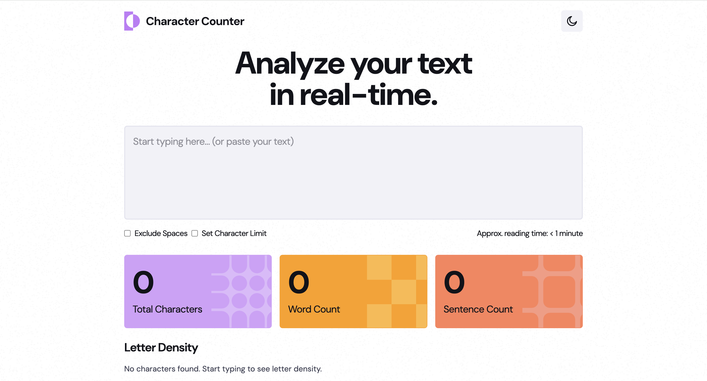

# Frontend Mentor - Character counter solution

This is a solution to the [Character counter challenge on Frontend Mentor](https://www.frontendmentor.io/challenges/character-counter-znSgeWs_i6). Frontend Mentor challenges help you improve your coding skills by building realistic projects.

### The challenge

Users should be able to:

- Analyze the character, word, and sentence counts for their text
- Exclude/Include spaces in their character count
- Set a character limit
- Receive a warning message if their text exceeds their character limit
- See the approximate reading time of their text
- Analyze the letter density of their text
- Select their color theme
- View the optimal layout for the interface depending on their device's screen size
- See hover and focus states for all interactive elements on the page

### Screenshot

### Links

- Solution URL: [frontendmentor.io](https://your-solution-url.com)
- Live Site URL: [Netlify](https://your-live-site-url.com)

### Built with

- [React](https://reactjs.org/) - JS library
- [Tailwind CSS](https://tailwindcss.com/) - CSS framework
- [Zustand](https://github.com/pmndrs/zustand) - State management
